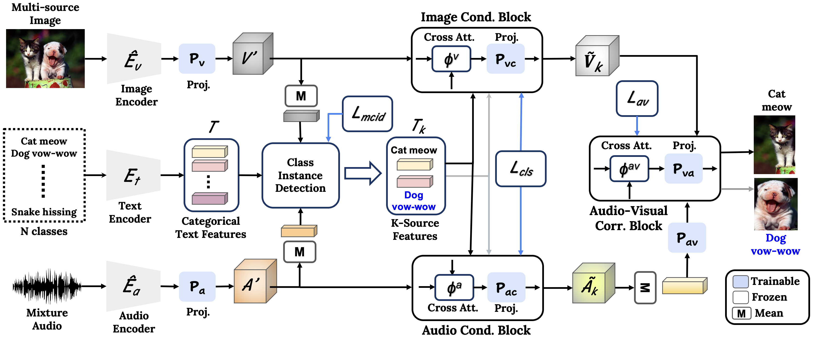

# T-VSL: Text-Guided Visual Sound Source Localization in Mixtures (CVPR 2024)
[Paper](https://openaccess.thecvf.com/content/CVPR2024/papers/Mahmud_T-VSL_Text-Guided_Visual_Sound_Source_Localization_in_Mixtures_CVPR_2024_paper.pdf) | [Supplementary](https://openaccess.thecvf.com/content/CVPR2024/supplemental/Mahmud_T-VSL_Text-Guided_Visual_CVPR_2024_supplemental.pdf) | [Arxiv](https://arxiv.org/abs/2404.01751) | [Video](https://www.youtube.com/watch?v=oKc8RwDHjsA) | [Poster](https://drive.google.com/file/d/1-RcoTY8aR8b9JbloNnGGCAAiNWCdOPyP/view?usp=drive_link)
<br/>
by [Tanvir Mahmud](https://sites.google.com/view/tanvirmahmud),
[Yapeng Tian](https://www.yapengtian.com/),
[Diana Marculescu](https://www.ece.utexas.edu/people/faculty/diana-marculescu)
<br/>

T-VSL incorporates the text modality as an intermediate feature guide using tri-modal joint embedding models (e.g., AudioCLIP) to disentangle the semantic audio-visual source correspondence in multi-source mixtures. 

<div align="center">
  
</div>


## Environment

To setup the environment, please simply run

```
pip install -r requirements.txt
```


## Datasets

###  MUSIC

Data can be downloaded from [Sound of Pixels](https://github.com/roudimit/MUSIC_dataset)

###  VGG-Instruments

Data can be downloaded from [Mix and Localize: Localizing Sound Sources in Mixtures](https://github.com/hxixixh/mix-and-localize)

###  VGG-Sound Source

Data can be downloaded from [Localizing Visual Sounds the Hard Way](https://github.com/hche11/Localizing-Visual-Sounds-the-Hard-Way)


## Train

For training the T-VSL model, please run

```
python main.py --train_data_path ./data/vggsound \
        --mode train --test_data_path ./data/vggsound \
        --test_gt_path ./metadata/vggsound_duet_test.csv \
        --output_dir ./path/to/output/dir \
        --id vggsound_duet --model tvsl \
        --trainset vggsound_duet --num_class 221 \
        --testset vggsound_duet --epochs 100 \
        --batch_size 256 --init_lr 0.01 \
        --lr_schedule cos --multiprocessing_distributed \
        --ngpu 4 --port 11342 --ciou_thr 0.3 \
        --iou_thr 0.3 --save_visualizations \
        --audioclip_ckpt_path ./pretrained_weights/AudioCLIP-Full-Training.pt
```

## Test

For testing and visualization, simply run

```
python main.py --mode test \
        --train_data_path ./data/vggsound \
        --test_data_path ./data/vggsound \
        --test_gt_path ./metadata/vggsound_duet_test.csv \
        --output_dir ./path/to/output/dir \
        --id vggsound_duet --model tvsl \
        --trainset vggsound_duet --num_class 221 \
        --testset vggsound_duet --epochs 100 \
        --batch_size 256 --init_lr 0.01 \
        --lr_schedule cos --multiprocessing_distributed \
        --ngpu 4 --port 11342 --ciou_thr 0.3 \
        --iou_thr 0.3 --save_visualizations \
        --load /path/to/pretrained/ckpt \
        --audioclip_ckpt_path ./pretrained_weights/AudioCLIP-Full-Training.pt
```

## 👍 Acknowledgments
This codebase is based on [AVGN](https://github.com/stoneMo/AVGN) and [AudioCLIP](https://github.com/AndreyGuzhov/AudioCLIP). Thanks for their amazing works.


## LICENSE
T-VSL is licensed under a [UT Austin Research LICENSE](./LICENSE).


## Citation
If you find this work useful, please consider citing our paper:

## BibTeX
```bibtex
@inproceedings{mahmud2024t,
  title={T-vsl: Text-guided visual sound source localization in mixtures},
  author={Mahmud, Tanvir and Tian, Yapeng and Marculescu, Diana},
  booktitle={Proceedings of the IEEE/CVF Conference on Computer Vision and Pattern Recognition},
  pages={26742--26751},
  year={2024}
}
```

## Contributors
<a href="https://github.com/enyac-group/T-VSL/graphs/contributors">
  
</a>